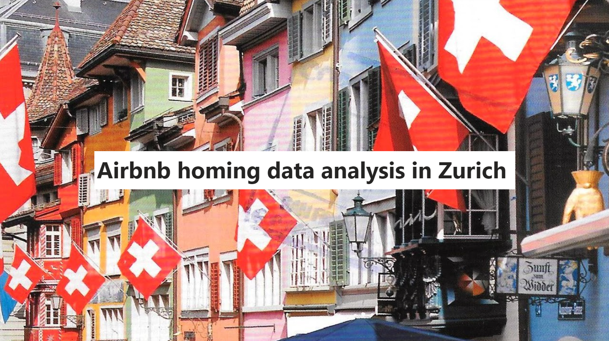
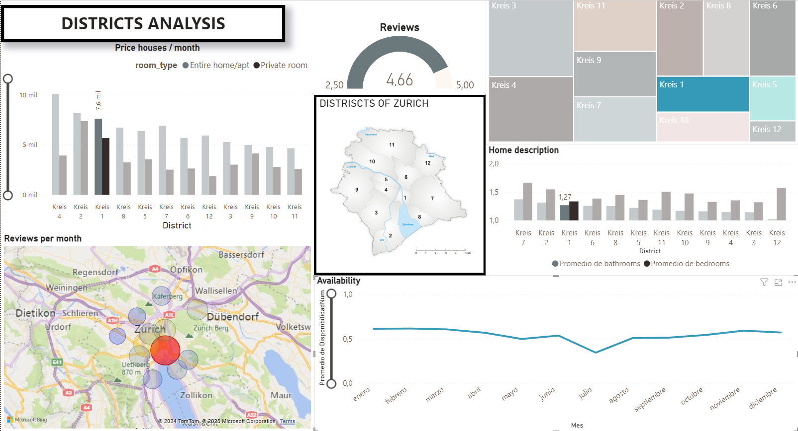

----------------
----------------
# 
 **Airbnb homing data analysis in Zurich** 

----------------
----------------
      Jose Luis Vázquez Vicario
      Data Analyst | Biologist
      LinkedIn: www.linkedin.com/in/jlvv
      Email: eljl2v@gmail.com
**
This project is licensed under the MIT License
**

    

## **RESUME**
This project delves into the dynamics of Zurich's Airbnb market, offering valuable insights for professionals seeking the best accommodations.

Utilizing data from Inside Airbnb [https://insideairbnb.com/get-the-data/], the analysis focuses on essential attributes like the location in the differents districts that compund Zurich, apartment and roms properties (number of bathrooms, bedrooms,accommodation capacity), room type and rental prices. A key challenge was the imputation of missing data, particularly in the 'bathrooms' column, which was addressed using the K-Nearest Neighbors (KNN) algorithm.

The findings reveal important patterns and trends that drive rental prices, providing a robust foundation for making informed decisions in the competitive Zurich housing market.

**Key words:** Airbnb, Zurich, data analysis, K-Nearest Neighbors, KNN, rental prices, housing market, housing prices, accommodations, data science, professional relocation.

## **OBJETIVE**
This project aims to analyze Zurich's Airbnb housing market to provide professionals, above all europeans, who are looking for better job opportunities, with actionable insights for finding optimal accommodations.

By examining key factors such as room type, number of bathrooms, accommodation capacity, and rental prices, the analysis uncovers patterns and trends that influence pricing. The K-Nearest Neighbors (KNN) algorithm is employed to address missing data, ensuring a complete and reliable dataset.

The goal is to equip users with the knowledge needed to make informed rental decisions in Zurich.

## **STRUCTURE OF THE WORKING AREA - FOLDER STRUCTURE**
**Airbnb_homing_data_analysis_in_Zurich (main folder)**
- **data :** contains raw & postreated data and images showed in the notebook
- **ENV_Airbnb_homing_data_analysis_in_Zurich :** virtual environment (ENV.)
- **libraries.txt :** libraries needed to work
- **README.md :** description of the project
- **Airbnb_homing_data_analysis_in_Zurich.ipynb :** notebook working with procedures, steps and results.

### **Interactive PowerBI Presentation** [link](https://app.powerbi.com/view?r=eyJrIjoiNTUxMjE0ZWItMjIzYS00NzZjLWE5ODAtODk4N2IwYzVkZGVjIiwidCI6IjhhZWJkZGI2LTM0MTgtNDNhMS1hMjU1LWI5NjQxODZlY2M2NCIsImMiOjl9&pageName=0f10a9a68b08cbdba667)

